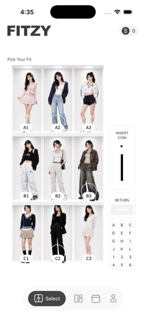
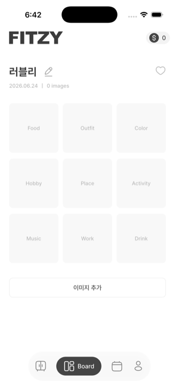
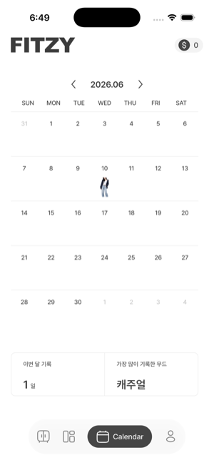
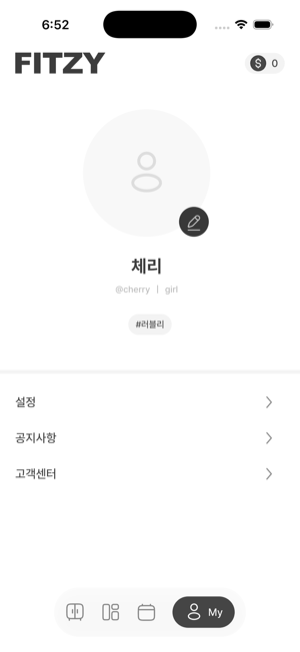

<div align="center">


### 추구미를 도달 가능미로.

매일 코인 한 개로 그날의 **추구미(fit·무드)** 를 뽑고, 그 무드대로 하루를 살며
**9칸 보드**를 사진으로 채워 캘린더에 누적하는 **데일리 무드 기록 앱**.


</div>

---

## 📱 스크린샷

<table>
  <tr>
    <td align="center"><br/><b>Select</b><br/><sub>9무드 뽑기 (자판기)</sub></td>
    <td align="center"><br/><b>Board</b><br/><sub>9칸 채우기</sub></td>
    <td align="center"><br/><b>Calendar</b><br/><sub>완성 보드 기록</sub></td>
    <td align="center"><br/><b>My</b><br/><sub>프로필</sub></td>
  </tr>
</table>

> 비주얼은 Figma 시안 → Codex HTML/CSS → Flutter 위젯으로 **디자인 토큰 기반 번역**. 한글 폰트는 [Pretendard](https://github.com/orioncactus/pretendard).

---

## ✨ 핵심 루프

```
[코인 1개 지급]  매일 자정 1개 (이월 없음)
        ▼
[Select]  9무드 중 하나 뽑기 → 코인 1 소모 · 오늘 무드 확정
        ▼
[Board]   뽑은 무드의 9칸(Food·Outfit·Color·…)을 촬영/갤러리로 채움
        ▼
[자정 마감]  그날 보드 finalize (이미지 잠금)
        ▼
[Calendar]  완성된(9/9) 보드만 날짜에 기록 + 월 통계
```

## 🧩 기능

- **일일 코인** — 자정 1개 지급, 이월 없음, 하루 1회 뽑기
- **Select** — 3×3 무드 그리드 + 자판기 UI, 성별별 무드 이미지
- **Board** — 제목(편집)·하트·N images, 9칸을 사진으로 채우기(즉시 저장·교체·삭제), 자정 마감
- **Calendar** — 월 그리드, 완성 보드 썸네일, 이번 달 기록 N일·가장 많이 기록한 무드
- **My** — 프로필(닉네임·@아이디·성별·태그) + 설정/공지/고객센터
- **온보딩 4스텝** + 최소 회원가입(로컬)

### 9 무드 / 9 카테고리

| 무드 | 러블리 · 캐주얼 · 스포티 · 스트릿 · 미니멀 · 빈티지 · 프레피 · 시크 · 청순 |
|---|---|
| **보드** | Food · Outfit · Color / Hobby · Place · Activity / Music · Work · Drink |

---

## 🛠 기술 스택

| 영역 | 사용 |
|---|---|
| 프레임워크 | Flutter / Dart |
| 상태관리 | Provider (ChangeNotifier) |
| 로컬 저장 | shared_preferences (JSON) |
| 이미지 | image_picker · path_provider (documents 복사, **상대경로** 저장) |
| 에셋 | flutter_svg (아이콘) · Pretendard (폰트) |
| 설정 유도 | url_launcher |

## 🏗 아키텍처

데이터 계층을 **`Repository` 인터페이스**로 추상화 — 로컬(경로 A)과 Firebase(경로 B)를 교체점 한 곳에서 갈아끼울 수 있게 설계.

```
lib/
├─ models/        UserProfile · CoinState · MoodFit · BoardCategory · DayRecord (순수 Dart)
├─ data/          9무드 · 9카테고리 · 온보딩 카피 (콘텐츠 외부화)
├─ repositories/  DataRepository (추상) ← A↔B 교체점
├─ services/      StorageService(로컬 구현) · ImageStoreService · date_keys
├─ providers/     Profile · Coin · Board (ChangeNotifier)
├─ screens/       RootGate · Onboarding · SignUp · MainShell · Select/Board/Calendar/My
├─ widgets/       FitzyHeader · FloatingNav
└─ theme/         app_colors · app_text_styles · app_spacing · app_theme (디자인 토큰)
```

- **로직과 디자인 분리** — 모델/서비스/프로바이더(순수 로직)와 theme/screens/widgets(비주얼)를 별도 패스로 빌드
- **콘텐츠 외부화** — 무드·카테고리·문구는 `data/`, 색·타이포는 `theme/` 토큰
- **테스트** — 코인/뽑기/마감 경계, 저장→로드 왕복, 전체 루프 통합 등 22개

---

## 🚀 시작하기

```bash
# 1. 의존성 설치
flutter pub get

# 2. 실행 (iOS 시뮬레이터 / Android 에뮬레이터)
flutter run

# 3. 테스트
flutter test
```

> 요구: Flutter 3.44+ / Dart 3.12+. iOS는 카메라·사진 권한(Info.plist 한국어 문구 포함).

---

## 🗺 진행 상태

- ✅ **v0.1** — 로직(코인→뽑기→보드→마감→캘린더 전체 루프) 동결
- ✅ **v0.2** — Figma/Codex 디자인 번역(4화면+셸) · 폴리시 · 마감(표시/엣지)
- ⏭ 다음 — 앱 아이콘/스토어 준비 · 프로필 이미지 업로드 · (선택) 경로 B(Firebase) 동기화

## 📄 라이선스 / 크레딧

- 폰트: **Pretendard** — SIL Open Font License 1.1 (`assets/fonts/OFL.txt`)
- 디자인: Figma 시안 기반, Codex HTML/CSS → Flutter 번역

<div align="center"><sub>FITZY · 추구미를 도달 가능미로.</sub></div>
